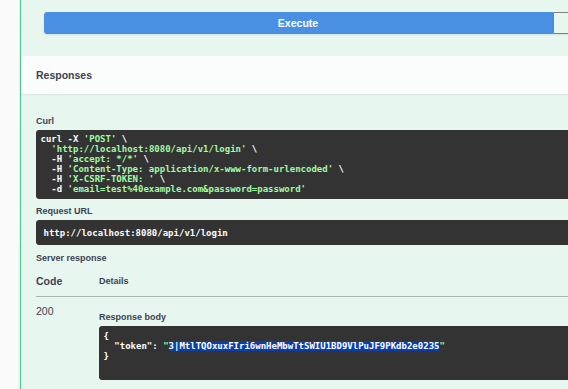

# The example of REST API with Laravel 13, php 8.5

This is an example of REST API with Laravel 13, for learning purposes. 
Use Action classes foe clean code of the controllers.
Use DTO and Repository patterns for index(). 

I will be glad to see your issues or your pull requests.

## Installation

1. Clone this repository (https://github.com/bibrkacity/REST-example-with-Laravel-13.git) and `cd` into root folder ( *your-path*/rest-example-13)
2. Copy `.env.example` to `.env`
3. Run `composer install`
4. Run `./vendor/bin/sail up`
5. Run `./vendor/bin/sail artisan migrate`
6. Run `./vendor/bin/sail artisan db:seed`
7. Run `php artisan l5-swagger:generate`

Now you can visit the Swagger UI at http://127.0.0.1:8000/api/docs 

## Work with Swagger UI

First, you need to log in with `test@example.com` and `password`:
1. Dropdown menu -> Auth, then click `Login`:
   
2. Click **Try it out** and enter credentials:
   
3. Copy token in clipboard:
   
4. Click `Authorize` in the top-right area of the page and paste token:
   
5. Click `Authorize` in a popup window

Now you can use Swagger UI to test your API.

## MySQL console

run `./vendor/bin/sail mysql` to open MySQL console. 

Also, you can use `mysql -h0.0.0.0 -P3307 -uroot -p` (password `Password1234`) to connect to MySQL.

## Unit testing of the REST API

Run `php artisan test` to run unit tests for the REST API endpoints.

## Learning the REST API

1. [REST API URI Naming Conventions and Best Practices](https://restfulapi.net/resource-naming/)
2. [REST API Tutorial](https://www.restapitutorial.com)

